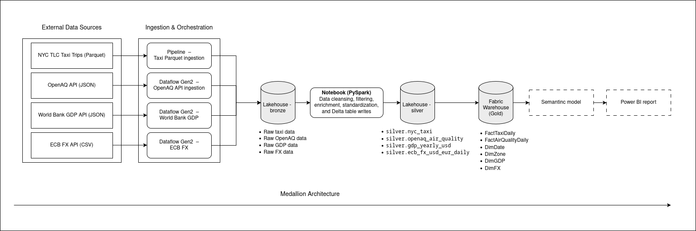
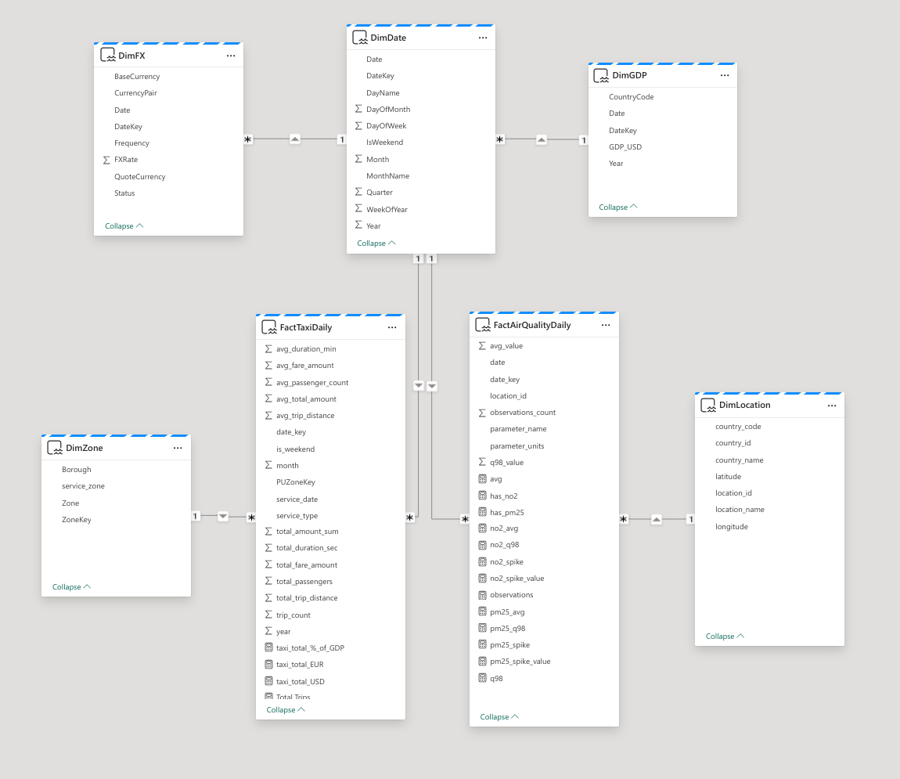

# Data Lineage

This document describes the **logical data lineage** of the project, from external data sources through ingestion, transformation, modeling, and analytical consumption.

Microsoft Fabric captures operational lineage between pipelines, dataflows, lakehouse tables, warehouse tables, semantic models, and reports via the **Lineage View**. 

The diagrams in this document represent **conceptual lineage** and are intended to communicate architectural intent.

---

## Diagram Index

- **Diagram 1 — End-to-End Lineage (Logical Overview)**  
  File: `images/lineage_end_to_end.png`  
  Purpose: shows the full flow from sources → ingestion → Bronze → Silver → Gold → semantic model → report.

- **Diagram 2 — Gold Model Lineage (Star Schema + Semantic Model)**  
  File: `images/lineage_gold_semantic.png`  
  Purpose: shows fact and dimension tables and how semantic measures depend on them.
---

## Diagram 1 — End-to-End Lineage (Logical Overview)

*Figure 1. End-to-end logical data lineage illustrating the medallion architecture and analytical consumption.*

## Diagram 2 — Gold Model Lineage (Star Schema + Semantic Model)

*Figure 2. Conceptual gold-layer star schema and semantic model dependencies.*

**Note:**  
This diagram reflects the logical relationships as defined in the Fabric semantic model and is included to complement the conceptual star schema representation.

